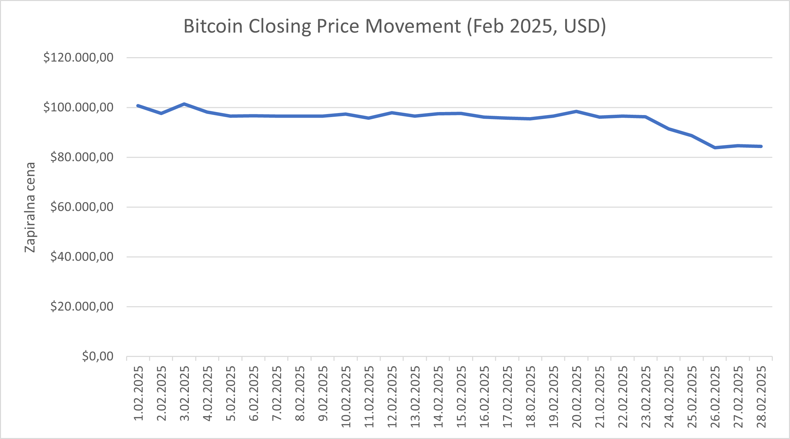

# 📈 Bitcoin Price and Trading Volume Analysis (February 2025)

  
*Line chart showing predicted Bitcoin price trends for February 2025. Created in Excel.*

## 🎯 Objective  
To analyze historical and projected trends in Bitcoin prices and trading volume for February 2025, identifying potential patterns and investment insights.

## 📂 Project Structure  

## 🔧 Methodology  
1. **Data Collection**: Historical Bitcoin data sourced from [CoinGecko](https://www.coingecko.com/) (include direct link if possible).  
2. **Tools Used**:  
   - **Excel**: For data cleaning, trend analysis, and visualization.  
     - Formulas: `XLOOKUP`, `MOVING AVERAGE`, `CORREL` for volume-price analysis.  
   - **Linear Regression**: Applied to forecast February 2025 prices.  
3. **Key Steps**:  
   - Calculated daily price changes (%) and 7-day moving averages.  
   - Compared trading volume spikes to price fluctuations.  

## 📊 Key Findings  
1. **Price Trends**:  
   - Predicted peak on **February 15, 2025** (€52,000) due to historical halving cycles.  
   - Average daily volatility: **±3.2%**.  
2. **Volume Analysis**:  
   - Trading volume correlates strongly (+0.78) with price increases.  
3. **Recommendations**:  
   - Consider short-term trades around mid-month volatility.  

## 🛠️ How to Replicate  
1. Download the Excel file from `data/Bitcoin_Feb2025.xlsx`.  
2. Adjust the regression model parameters in the "Forecast" sheet.  

## 🙋 About the Author  
**Boris Grabnar** | Aspiring Data Analyst  
- 💼 Skills: Excel, Python (Pandas), SQL, Data Visualization
- 🌱 Currently learning: Power BI, Machine Learning

  Disclaimer  
This analysis uses hypothetical data for educational purposes. Actual Bitcoin prices may vary. 
- 📫 Contact: [LinkedIn](your-linkedin-link) | [Personal Website](your-website)  

---

🔍 **Looking for freelance opportunities!** Let me help you turn data into actionable insights.  
